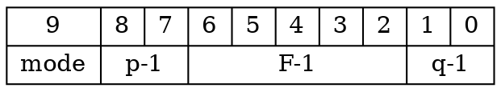
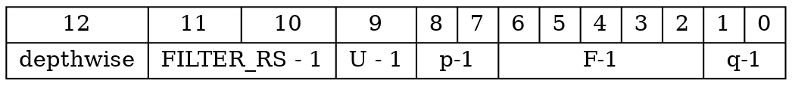

# AOC 2025 Final Project

## Team 1 : Cache Me If You Can
N26140626 葉人豪
E94101119 宋晉誠
E24104032 吳秉宥
E24106034 簡德彥
F74106092 吳翰宇

## Main Purpose And Motivation 
本研究的主要目的是在執行卷積神經網路（CNN）推論時，優化系統的能源效率。隨著深度學習模型在邊緣裝置與嵌入式系統中的應用越來越普遍，能源消耗成為一個關鍵課題。根據 ESL 的資料指出，DRAM 存取最多可佔系統總能耗的 70%，因此，如何有效減少資料移動，並選用一個適合實作且修改過的模型放在 Eyeriss 硬體上運行，最終選擇 Mobilenet v1 去改良，去檢測是否符合我們預期結果。成為提升能效的首要任務。

本研究針對此問題提出三大優化策略：

* 最小化資料移動：減少對 DRAM 和全域快取的讀寫次數，降低能量消耗。
* 強化資料重用：在處理單元（Processing Elements）內部實現最大化的資料重用，進一步節省功耗。
* 資料壓縮與閘控技術：運用如游程編碼（Run-Length Coding）與跳過零值的運算（Zero Skipping）等技巧，減少不必要的運算與資料傳輸。

這些方法能夠協助提升 CNN 推論在硬體上的能源效率，延長裝置使用壽命、減少熱功耗、並推動 AI 系統朝向低功耗、高效能的方向發展。

### Model Comparison Table

| Model            | Params     | FLOPs               | Accuracy                   | Operators                                                                 | DRAM Access Optimization                                                                                     |
|------------------|------------|---------------------|----------------------------|---------------------------------------------------------------------------|-----------------------------------------------------------------------------------------------------------------------------|
 MobileNet    | 3.5M       | 334.22M (thop)      | (ImageNet) top1=69.48% top5=89.26% | Conv, BN, ReLU6, InvertedResidual                                      |**High:** Low params, high sparsity, but layer shape variation reduces reuse on original Eyeriss. DRAM access ~1-3 MB on v2 with CSC compression.                    |
| SqueezeNet      | 1.2M  | 349M (MACs)   | (ImageNet) top1=57.5% top5=80.3%   | Conv, ReLU, MaxPool, AvgPool, Concat, Reshape | **Moderate:** Very low params, fits global buffer (108 kB), but lower reuse due to fire modules. DRAM access ~2-4 MB after pruning.                          |
| - | - | - | - | - | ------------------------------------------------------------------------------------------------------------------------------------------------------------ |
| ResNet50        | 25.6M | ~7.7G (MACs)  | (ImageNet) top1=76.15% top5=92.87% | Conv, BN, ReLU, Add, MaxPool                  | **High:** Stable layer shapes, high data reuse with 3x3 filters, moderate params. Pruned ResNet50 achieves ~3-5 MB DRAM access. Versatile and hardware-friendly. |
| VGG16           | 138M  | ~30.9G (MACs) | (ImageNet) top1=71.59% top5=90.38% | Conv, ReLU, MaxPool                           | **Low:** High params (528 MB), exceeds global buffer, high DRAM access (~5-10 MB even after pruning). Stable layers but not memory-efficient.                |
| EfficientNet B0 | 5.3M  | ~0.78G (MACs) | (ImageNet) top1=77.1% top5=93.3%   | Conv, BN, Swish, MBConv                       | **High:** Low params, high sparsity, but MBConv layer shape variation impacts original Eyeriss. DRAM access ~2-4 MB on v2.                      |
| InceptionV3     | 23.8M | ~5.7G (MACs)  | (ImageNet) top1=77.9% top5=93.7%   | Conv, BN, ReLU, Concat, MaxPool               | **Moderate:**  High reuse with multi-size filters, but layer shape variation increases DRAM access (~3-6 MB on v2).                             |
| DenseNet121     | 8M    | ~5.7G (MACs)  | (ImageNet) top1=74.98% top5=92.21% | Conv, BN, ReLU, Concat, MaxPool               | **High:** Low params, stable layers, high reuse via dense connections. DRAM access ~2-5 MB after pruning.                                                    |
| ConvNeXt Tiny   | 28.6M | ~8.7G (MACs)  | (ImageNet) top1=82.1% top5=95.8%   | Conv, LayerNorm, GELU, MaxPool                | **High:** High reuse with 7x7 filters, stable layers. DRAM access ~3-6 MB. Good for original Eyeriss.                                                        |

>[!Warning]
>Why not choose SqueezeNet
>SqueezeNet **may not easy** to implement in Eyeriss(mapping parameter).


## Software
### AI Model Design and Quantization
**file path:**`AOC-PE-filter-size-change/Performance_Modeling/mobilenetv1-cifar10.ipynb`

you can run **mobilenetv1-cifar10.ipynb** with kaggle or colab.

### Model Choosing : Modified **Mobilenet_v1** with cifar10 dataset
```python=
import torch
import torch.nn as nn
import torch.ao.quantization as tq

class DepthwiseSeparableConv(nn.Module):
    """Depthwise Separable Convolution Block: Depthwise Conv2d + Pointwise Conv2d"""
    def __init__(self, in_channels, out_channels, stride=1):
        super().__init__()
        # Depthwise Convolution (3x3, groups=in_channels)
        self.depthwise = nn.Sequential(
            nn.Conv2d(
                in_channels, in_channels, kernel_size=3, stride=stride, padding=1, 
                groups=in_channels, bias=False
            ),
            nn.BatchNorm2d(in_channels),
            nn.ReLU(inplace=True)
        )
        # Pointwise Convolution (1x1)
        self.pointwise = nn.Sequential(
            nn.Conv2d(
                in_channels, out_channels, kernel_size=1, stride=1, padding=0, bias=False
            ),
            nn.BatchNorm2d(out_channels),
            nn.ReLU(inplace=True)
        )
    
    def forward(self, x):
        x = self.depthwise(x)
        x = self.pointwise(x)
        return x

    def fuse_modules(self):
        """Fuse Conv2d, BatchNorm2d, and ReLU for quantization"""
        tq.fuse_modules(self.depthwise, ['0', '1', '2'], inplace=True)
        tq.fuse_modules(self.pointwise, ['0', '1', '2'], inplace=True)

class MobileNetV1(nn.Module):
    """MobileNetV1 adapted for CIFAR-10 with final output 2x2x1024 → 1x1x1024"""
    def __init__(self, in_channels=3, in_size=32, num_classes=10):
        super().__init__()
        
        # Initial Conv2d layer
        self.conv1 = nn.Sequential(
            nn.Conv2d(in_channels, 32, kernel_size=3, stride=1, padding=1, bias=False),
            nn.BatchNorm2d(32),
            nn.ReLU(inplace=True)
        )
        
        # Depthwise Separable Convolution layers
        self.layers = nn.Sequential(
            DepthwiseSeparableConv(32, 64, stride=1),    # 32x32x64
            DepthwiseSeparableConv(64, 128, stride=2),   # 16x16x128
            DepthwiseSeparableConv(128, 128, stride=1),  # 16x16x128
            DepthwiseSeparableConv(128, 256, stride=2),  # 8x8x256
            DepthwiseSeparableConv(256, 256, stride=1),  # 8x8x256
            DepthwiseSeparableConv(256, 512, stride=2),  # 4x4x512
            DepthwiseSeparableConv(512, 512, stride=1),  # 4x4x512 
            DepthwiseSeparableConv(512, 1024, stride=2), # 2x2x1024
        )
        
        # Global average pooling and fully connected layers
        self.avgpool = nn.AdaptiveAvgPool2d(1)  # 2x2x1024 → 1x1x1024
        self.fc = nn.Linear(1024, num_classes)  # 1024 → 10
    
    def forward(self, x):
        x = self.conv1(x)
        x = self.layers(x)
        x = self.avgpool(x)                     # 2x2x1024 → 1x1x1024
        x = torch.flatten(x, start_dim=1)       # 1x1x1024 → 1024
        x = self.fc(x)                          # 1024 → 10
        return x
    
    def fuse_modules(self):
        """Fuse Conv2d, BatchNorm2d, and ReLU for quantization"""
        self.conv1.eval()
        tq.fuse_modules(self.conv1, ['0', '1', '2'], inplace=True)
        for layer in self.layers:
            layer.eval()
            layer.fuse_modules()
        self.eval()

if __name__ == "__main__":
    model = MobileNetV1()
    inputs = torch.randn(1, 3, 32, 32)
    print(model)
    from torchsummary import summary
    summary(model, (3, 32, 32), device="cpu")
```

for quantized model, model acheive the following metrics:
- <font style="color:#fc6a49">**top-1 accuracy on CIFAR-10 $\ge$ 80% (OK)**</font>
- <font style="color:#fc6a49">**accuracy drop $\le$ 1% compared to your full-precision model (OK)**</font>


### Workload Analysis

* Similar to environments in Lab2
1. Create and activate virtual environment
```bash
conda create -n aoc python=3.10 -y
conda activate aoc
```
2.Install packages
```bash
cd AOC-PE-filter-size-change/Performance_Modeling
pip install -r requirements.txt
```

#### FP32 - mobilenetv1.pt
**file path:**`AOC-PE-filter-size-change/Performance_Modeling/weights/mobilenetv1.pt`

```bash
python3 profiling.py weights/mobilenetv1.pt
```
* **accuracy=0.8733** , Model size : 4.40 MB


#### INT8 - mobilenetv1-power2.pt
**file path:**`AOC-PE-filter-size-change/Performance_Modelin/Profiling_Results/weights/mobilenetv1-power2.pt`

```bash
python3 profiling.py weights/mobilenetv1-power2.pt -b power2
```
* **accuracy=0.8694** , Model size : 1.117842MB


### Analytical Model – mapping parameters
#### Conv2D Shape Parameter

| Parameter | Description                                           |
| -------- | ----------------------------------------------------- |
| N        | batch size                                            |
| H/W        | input height/width |
| R/S        | filter height/width |
| E/F        | output height/width |
| C        | input channels |
| M        | output channels |
| U        | stride |
| P        | padding |

#### RS Dataflow Mapping Parameter

| Parameter | Description                                           |
| -------- | ----------------------------------------------------- |
| m        | number of ofmap channels stored in the global buffer  |
| n        | number of ofmaps/ifmaps used in a processing pass     |
| e        | width of the PE set (strip-mined if nessary)          |
| p        | number of filters processed by a PE set               |
| q        | number of ifmap/filter channels processed by a PE set |
| r        | number of PE sets for different ifmap/filter channels |
| t        | number of PE sets for different filters|

### Eyeriss Mapping Result

We use the following mapping result to generate the verification test data for the subsequent testbench.

```bash
cd AOC-PE-filter-size-change/Performance_Modeling
python3 main.py ./weights/mobilenetv1-power2.pt
```

#### CONV.csv

| layer              | glb_usage | glb_read  | glb_write | glb_access | dram_read | dram_write | dram_access | macs    | latency      | energy_per_layer | power_per_layer | m   | n | e | p | q | r | t | Latency   |
|--------------------|-----------|-----------|-----------|------------|-----------|------------|-------------|---------|--------------|------------------|-----------------|-----|---|-|---|-|---|-|-----------|
| mobilenetv1.conv0  | 33976     | 150400    | 163840    | 314240     | 7808      | 32768      | 40576       | 884736  | 240608       | 13.087224        | 10878.461231546748 | 32  | 1 | 8 | 4 | 3 | 1 | 2 | 240608    |
| mobilenetv1.conv1  | 34472     | 1462528   | 1114112   | 2576640    | 69888     | 65536      | 135424      | 2686976 | 1523136      | 58.60593599999999 | 7695.430480272279 | 64  | 1 | 4 | 4 | 4 | 2 | 2 | 1523136   |
| mobilenetv1.conv2  | 35240     | 2265344   | 1081344   | 3346688    | 110848    | 32768      | 143616      | 2392064 | 1885632      | 67.44561599999999 | 7153.635067712045 | 128 | 1 | 4 | 4 | 4 | 2 | 2 | 1885632   |
| mobilenetv1.conv3  | 33704     | 2955776   | 2129920   | 5085696    | 121344    | 32768      | 154112      | 4489216 | 2768256      | 91.34985599999999 | 6599.812734082396 | 128 | 1 | 4 | 4 | 4 | 2 | 2 | 2768256   |
| mobilenetv1.conv4  | 34088     | 2298112   | 1064960   | 3363072    | 106752    | 16384      | 123136      | 2244608 | 1851840      | 63.210096        | 6826.734059097978 | 256 | 1 | 4 | 4 | 4 | 2 | 2 | 1851840   |
| mobilenetv1.conv5  | 33320     | 3021312   | 2113536   | 5134848    | 162304    | 16384      | 178688      | 4341760 | 2807168      | 96.47139199999998 | 6873.2182755004305 | 256 | 1 | 4 | 4 | 4 | 2 | 2 | 2807168   |
| mobilenetv1.conv6  | 33512     | 2363648   | 1056768   | 3420416    | 153856    | 8192       | 162048      | 2170880 | 1920960      | 71.43575999999997 | 7437.50624687656 | 512 | 1 | 4 | 4 | 4 | 2 | 2 | 1920960   |
| mobilenetv1.conv7  | 33128     | 3152384   | 2105344   | 5257728    | 281088    | 8192       | 289280      | 4268032 | 2998656      | 119.71900799999999 | 7984.844410295812 | 512 | 1 | 4 | 4 | 4 | 2 | 2 | 2998656   |
| mobilenetv1.conv8  | 16808     | 2236928   | 1052672   | 3289600    | 543232    | 4096       | 547328      | 2134016 | 2333056      | 147.212896       | 12619.748175783176 | 1024 | 1 | 2 | 4 | 4 | 2 | 4 | 2333056   |
  
>[!Warning]
> Because the algorithm for the first 3x3 convolution in the first layer of eyeriss.py is different from the depthwise separable convolution, it has been recalculated separately.

#### FC_layer.csv

| layer              | glb_usage | glb_read  | glb_write | glb_access | dram_read | dram_write | dram_access | macs    | latency      | energy_per_layer | power_per_layer | m   | n | e | p | q | r | t | Latency   |
|--------------------|-----------|-----------|-----------|------------|-----------|------------|-------------|---------|--------------|------------------|-----------------|-----|---|-|---|-|---|-|-----------|
| FC_layer0  | 4456   |1334032|177152|1511184|1070184|1024|1071208|10240|2094652|229.89758299999997|21950.909554427177|1024|1|1|4|4|6|3|2094652


## Hardware
### Overall architecture


### PE config modification


為了支援MobileNet depthwise separable convolution 多了`depthwise`，`FILTER_RS-1`為可以支援kernel size from 1 to 3，將`mode`改為`U-1`用以支援stride = 1 or 2。

### PE (Process Element)

與Lab3大部分相同，但因應上面config改變，多了一些控制邏輯。

### SUPER (Super Ultra Processing Element RRR bon wo kai stream)

`filter_spad`可以同時存放pointwise filter與depthwise filter，進行depthwise convolution時會將depthwise psum存進`psum_spad`上半部，再以depthiwse psum作為pointwise psum 的 ifmap 與 pointwise filter 相乘得到depthwise separable convolution 結果。

### Formula deduction


由上式得出可以直接將depthiwse 結果直接做pointwise 結果。
#### Depthwise separable convolution

最後一排depthwise的row會變成由SUPER 組成的row，做最後的結果，若LN_config[2]=1，就會將SUPER 相接。

#### Normal convolution

SUPER也可以執行一般convolution，此時整個PE array行為就會與原本一樣。
這樣的好處可以將一次depthwise separable convolution在一次pass中做完，不用做一次depthwise後存入glb再做pointwise才得到結果，壞處是需要更大的乘法器。

### Controller for one pass
Controller_pass 負責協調 Eyeriss PE array 與 Global Buffer（GLB）間的資料傳輸，控制整個卷積運算中一個 pass 的資料流程，並根據參數設定啟動資料載入、PE 配置、卷積輸入與結果寫回等操作。以下為模組的主要功能說明與架構解析：
1. **I/O port definition**
- interface to Top module

| Name |I/O |Bits | Explanation |
|----------|--|-------|-------|
| start          |Input| 1| start signal      |
| bias_ipsum_sel |Input| 1| select which ipsum in this pass is used, bias or ipsum    |
| op_config      |Input|32| ctrl register define in lab4 |
| mapping_param  |Input|32| ctrl register define in lab4 |
| shape_param1   |Input|32| ctrl register define in lab4 |
| shape_param2   |Input|32| ctrl register define in lab4 |
|filter_baseaddr|Input|32|filter base address in glb|
|ifmap_baseaddr|Input|32|ifmap base addressin glb|
|bias_baseaddr|Input|32|bias base addressin glb|
|opsum_baseaddr|Input|32|opsum base addressin glb|
| done           |Output| 1| done signal |

- interface to PE array
```
/* same as lab3 */
```

- interface to glb

| Name |I/O| Bits | Explanation |
|-----------|-|-------|-------|
| glb_we     |Output| 4| write enable  |
| glb_w_addr |Output|32| write address |
| glb_w_data |Output|32| write data    |
| glb_re     |Output| 4| read enable |
| glb_r_addr |Output|32| read address |
| glb_r_data |Input |32| read data |

2. **State Diagram**


- 當接受到`start` signal時，會從`idle`進入`SET_CONFIG`狀態，開始scan ID給PE array
- Scan configuration完成後，會開始依序read filter, ifmap, ipsum
- 將PE array運算完的opsum寫回GLB中，並重複read ifmap, ipsum
- 直到所有`opsum`都已寫回glb中，跳轉至DONE狀態，此時將`pass_done` signal拉起，告知外界pass已做完，並回至`idle`
3. **PE ID setup and scanning chain**
- 使用 pe_array_id_generator 模組，根據輸入參數（如 p, q, r, t, e 等）計算整體 PE 陣列中的 XID、YID 分布。
- XID 掃描鏈、YID 掃描鏈對應 set_XID、set_YID 訊號，依據掃描順序送入每個 PE。
- LN（Local Neighbors） 設定鏈透過 set_LN 與 LN_config_in 一次性配置。

4. **Tag calculation logic**
- 參考lab3 PE array的testbench
- 為了處理Stride=2，相比於前者，增加額外的計數器u_ct來計算下次load ifmap的數量和tag位置

5. **Address calculation and glb control**
- 利用各個代表不同dimension的計數器chn_ct, col_ct, row_ct來計算當前read/write的address
- 為了更好模擬現實中的sram，我們將glb設計為read會有一個cycle的delay，以此為基準設計handshake signal

### Controller for one layer (tiling)
* 依照 mapping_param、shape_param1、shape_param2 決定從 DRAM 讀取多少資料，並寫入 GLB。
* 支援多種 tile/filter/channel/stride/padding 組合。


#### 參數解析
透過 `mapping_param` 與 `shape_param1`/`shape_param2`，解析出分塊所需的各種參數（如分塊大小、padding、stride、filter 尺寸、channel 數等），並計算出各種資料的實際寬高。

#### 狀態機控制
模組內部以狀態機（state machine）方式運作，主要狀態包含：

1. `IDLE`：等待啟動信號（`start`）。
1. `LOAD_IFMAP_DRAM_R` / `LOAD_IFMAP_GLB_W`：從 DRAM 讀取 ifmap，寫入 GLB。
1. `LOAD_FILTER_DRAM_R` / `LOAD_FILTER_GLB_W`：從 DRAM 讀取 filter，寫入 GLB。
1. `LOAD_BIAS_DRAM_R` / `LOAD_BIAS_GLB_W`：從 DRAM 讀取 bias，寫入 GLB。
1. `WRITE_OPSUM_GLB` / `WRITE_OPSUM_DRAM`：從 GLB 讀取 opsum，寫回 DRAM。
1. `RESET_OPSUM`：重設 GLB 中 opsum 區域爲 0。
1. `FINISH` / `DONE`：流程結束，等待下一次啟動。

#### 地址計算
針對 `ifmap`、`filter`、`bias`、`opsum` 等資料，分別設計了對應的地址計算 function，根據分塊參數與 base address 動態產生 DRAM/GLB 的存取位址。

#### 資料搬移流程
1. 依據狀態機流程，依序將 `ifmap`、`filter`、`bias` 由 DRAM 讀取並寫入 GLB。
1. 運算完成後，將 `opsum` 由 GLB 讀取並寫回 DRAM。
1. 每一階段皆有對應的計數器與條件判斷，確保分塊搬移正確進行。
1. 支援多層次分塊與多次搬移，直到所有資料處理完畢。
1. 流程重啟與結束
1. 當一輪分塊搬移結束後，根據參數判斷是否還有剩餘資料需要處理，若有則重啟流程，否則進入 `DONE` 狀態。

### Control flow

- When the testbench writes `1` to `op_config[0]`, it triggers the DLA to begin operation.
- The `tiling.sv` module detects this start signal and begins transferring data into the GLB.
- Once data movement is complete, `tiling.sv` sends a `tiling_done` signal to notify `Controller_pass.sv` to initiate a computation pass.
- After the pass is completed, `Controller.sv` asserts a `pass_done` signal to inform `tiling.sv`. The `tiling.sv` module then starts writing the partial sums (opsum) back to DRAM and proceeds to load the data for the next pass.
- This alternating sequence continues—data movement followed by computation—until `tiling.sv` detects that there is no more data to load, indicating that the entire layer has been processed.
- At this point, an `all_done` signal is sent to the host to indicate that the DLA has finished processing. Additionally, `op_config[0]` is cleared back to `0` to prevent the DLA from being unintentionally restarted.


## TVM
### Similar to Lab5.0 : Enviroment Setup
```bash
conda create -n tvm-lab
conda activate tvm-lab
conda install python=3.11
conda install llvmdev=18 -c conda-forge
```
```bash
pip3 install torch torchvision --index-url https://download.pytorch.org/whl/cpu
pip3 install onnx
pip3 install graphviz
pip3 install -e /opt/tvm/python
```
### 1. Codegen with TVM compiler

#### Enter TVM Folder
```shell
conda activate tvm-lab
cd TVM
```
#### Build the model

```shell
make build_model
```
#### visuTVM: Relay Graph Visualizer


To generate visualizations of the Relay graph:

```bash
make visuTVM
```

This command produces two SVG images representing the Relay graph:

- `./output/visu_VGG8_relay_ir.svg`: The original Relay IR (before the MergeComposite pass)
- `./output/visu_VGG8_relay_ir_pass.svg`: The Relay IR after pattern fusion and annotation passes


    * mobilenetv1_relay_ir
    
    

    * mobilenetv1_relay_ir_pass
    
    


### 2. Simulation and Performance Analysis (Failed)

For more config in compiling cpu-only version runtime, move into `testbench/cpu`, then use `make usage` for more details about configurations.
```
cd testbench/cpu
make usage
```
```
Usage: make [target]

Available targets:
  all                      - Build the project (default target)
  test     [CLASS][INDEX]  - Run the compiled executable with test input
  valgrind [CLASS][INDEX]  - Run Valgrind Massif to analyze memory usage
  test_full                - Run with 100 test input
  valgrind_full            - Run Valgrind Massifwith 100 test input
  clean                    - Remove all generated files

Environment Variables:
  CLASS=<num>   - Set class index for testing (default: 4)
  INDEX=<num>   - Set test index (default: 9)
```
It is needed to `make clean` before any new configuration applied.
- `make test` is the single shot of indecated image.
- `make test_full` will implement 100 images.


>[!Tip] Model Accuracy
>This modified Mobilnet_v1 model achieves 86.94% accuracy on the CIFAR-10 dataset.

But,our result is not fit in Mobilnet_v1 model accuracy.

### Single Test

#### Our result
```
(base) f74106092@user:~/TVM/testbench/cpu$ make test CLASS=2 INDEX=3
Run test
===============[ single test ]===============
Input file: ../../output/bin/input.bin
Weight file: ../../output/bin/weight.bin
Class index: 2
Image index: 3
=============================================
Image Test: 3/10 image class         bird
Model output
=============================================
[    airplane]   7.070%
[  automobile]   9.893%
[        bird]  12.953%  
[         cat]  15.809%
[        deer]  10.572%
[         dog]   6.694%
[        frog]   9.893%
[       horse]   6.564%
[        ship]   7.949%
[       truck]  12.604%
=============================================

```
#### Expected Results
```
(base) f74106092@user:~/aoc2025-lab5/testbench/cpu$ make test CLASS=2 INDEX=3
Run test
===============[ single test ]===============
Input file: ../../output/bin/input.bin
Weight file: ../../output/bin/weight.bin
Class index: 2
Image index: 3
=============================================
Image Test: 3/10 image class         bird


=============================================
[    airplane]   0.022%
[  automobile]   0.001%
[        bird]  99.802%
[         cat]   0.038%
[        deer]   0.015%
[         dog]   0.016%
[        frog]   0.091%
[       horse]   0.006%
[        ship]   0.007%
[       truck]   0.001%
=============================================

```

The problem we will figure out in future.

### Simulation
#### Makefile main options
|options|function|
|---|---|
|`pe%`|Unit test for PE in No.`%` testbench with Verilator.|
|`super%`|Unit test for SUPER in No.`%` testbench with Verilator.|
|`array%`|Unit test for PE Array in No.`%` testbench with Verilator.|
|`ppu%`|Unit test for PPU in No.`%` testbench with Verilator.|
|`gen_test_data_for_array`|Generate normal convolution one pass testbench data for array.|
|`gen_test_data_for_depthwise_array`|Generate depthwise separable convolution one pass testbench data for array.|
|`gen_test_data_for_pe`|Generate normal convolution testbench data for PE.|
|`gen_test_data_for_depthwise_pe`|Generate depthwise separable convolution testbench data for SUPER.|
|`vcs%`|Generate GLB mirror for No.`%` testbench as inital data in GLB, simulate one pass normal/depthwise separable convolution in module which consist of `PE_array`, `GLB`, `Controller_pass` with vcs.|
|`clean`|Remove unnecessary files.|


>[!Warning]
>`%` is a interger number which reperesent No.`%` testcase.
>If you replace `%` with `_all` in the options above, the Makefile will run all test cases.

#### Usage
Type
```bash
make <options>
```
