# Lab 3 Report

## Lab Design Description (40%)
Scores will be assigned based on the level of detail and the logical soundness of your description.
Each section should ideally include a block diagram to explain the module.

### Explain how you implement PE
> Explain how you handle the computation of the zero point of dequantization.  

根據Lab3講義所述，量化後模型在硬體實現矩陣乘法可以表示為  
$$
\bar y_{m,~e,~f} = \text{clanmp} \left[ \left( \left(
    (\bar b_m + \sum_{c,~r,~s} (\bar x_{c,~Ue+r,~Uf+s} \oplus 128) \cdot \bar w_{m,~c,~r,~s}^T) 
        \gg \frac{s_x s_w}{s_y} \right) \oplus 128 \right) ,0 , 255\right]$$  
其中$\bar x_{c,~Ue+r,~Uf+s} \oplus 128$ 為減去128在硬體上的實現，故在`PE.sv`中，讀入ifmap時，會先與128做bitwise xor，如下
```verilog
READ_IFMAP:begin
	if(ifmap_valid)begin
		ifmap_spad[
			ifmap_spad_cnt + `IFMAP_INDEX_BIT'd0
		] <= split_ifmap[0]  ^ `IFMAP_SIZE'd128;
		ifmap_spad[
			ifmap_spad_cnt + `IFMAP_INDEX_BIT'd1
		] <= split_ifmap[1]  ^ `IFMAP_SIZE'd128;
		ifmap_spad[
			ifmap_spad_cnt + `IFMAP_INDEX_BIT'd2
		] <= split_ifmap[2]  ^ `IFMAP_SIZE'd128;
		ifmap_spad[
			ifmap_spad_cnt + `IFMAP_INDEX_BIT'd3
		] <= split_ifmap[3]  ^ `IFMAP_SIZE'd128;
		ifmap_spad_cnt <= ifmap_spad_cnt + {1'b0, q};
	end
end
```
* State diagram
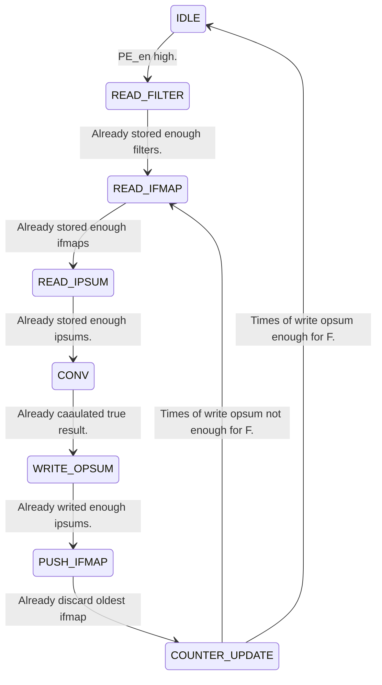
一旦`rst` high，就會將state設定為`IDLE`狀態、等待`PE_en` high，會先讀filter，讀完之後進入`READ_IFMAP`讀ifmap、再進入`RAED_IPSUM`讀ipsum、全部讀完後，會開始每個cycle做一次乘加的`CONV`，等待將正確答案存在`psum_spad`中、進入`WRITE_OPSUM`等待將答案都寫完後、進入`COUNTER_UPDATE`將各階段的counter reset，最後看輸出次數有沒有等於F再回到`IDLE`。

* Block diagram  
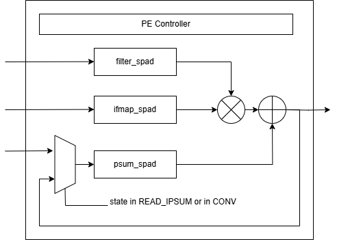  
由filter_spad與ifmap_spad內資料相乘，與psum_spad相加，在`READ_PSUM`讀入psum的時候，會直接寫入`psum_spad`，在`CONV`時，`psum_spad`會使用累加的值。其餘要怎麼丟棄多的ifmap、state的轉換由controller判斷。
### Explain how you implement PE array
> Including network (GIN/GON/LN) and multicast controller (MC)
* Multicast controller  
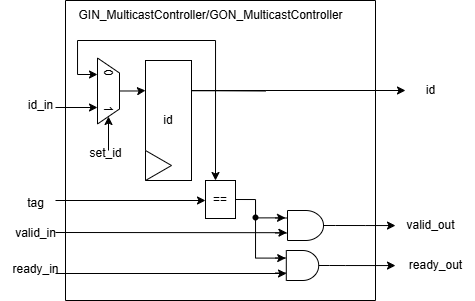  
由`id` register儲存，id，若`set_id` high，id會被更新為`id_in`，且會將當前儲存的id傳出給下一個multicast controller，在`tag`進來時，會比對其是否與`id` register相同，若相同，`valid_in` 與`ready_in`，就會被傳出去，否則被阻擋。
* GIN_Bus  
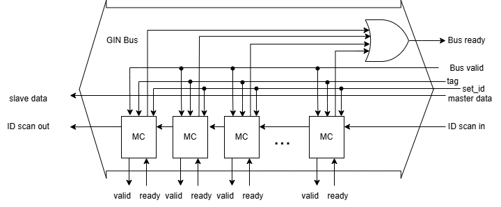  
除了MC，剩下的都是組合電路，Bus的`ID_scain_in` 會傳入第一個MC，第一個MC會傳id入第二個MC，整個Bus的MC會被串起來。MC會比對tag決定是否要傳入slave的`valid`, `ready`訊號，整條Bus的`ready`為通過MC的ready bitwise or，data會直接傳出。
* GIN  
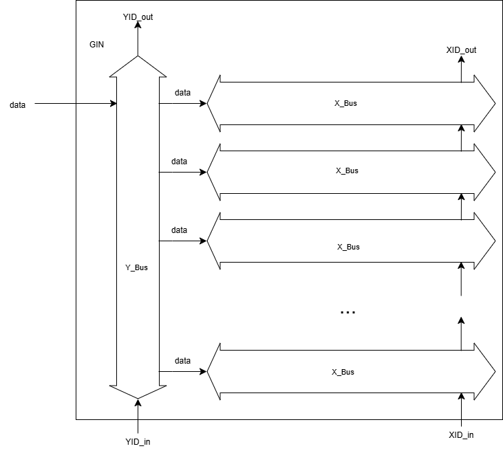  
將多個Bus串起來，資料留會先流經`Y Bus`，在流向 `X Bus`，`X Bus`的ID 也會透過`ID scan in`, `ID scan out`傳遞，最後也會輸出data，不過因為來源都一樣，可以直接將個輸出拼在一起形成32bit 的data輸出。
* GON_Bus  
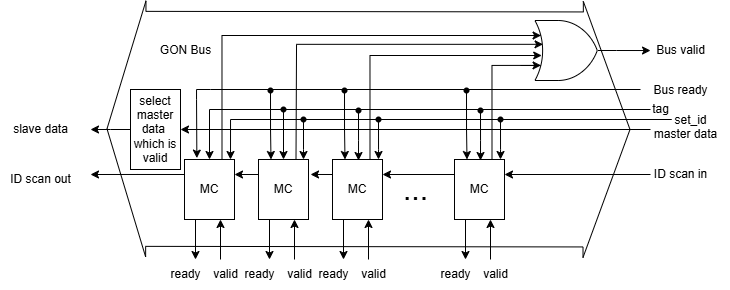
除了MC，剩下的都是組合電路，Bus的`ID_scain_in` 會傳入第一個MC，第一個MC會傳id入第二個MC，整個Bus的MC會被串起來。MC會比對tag決定是否要傳入slave的`valid`, `ready`訊號，整條Bus的`valid`為通過MC的valid bitwise or，data會透過另一個組合電路選擇valid 為 high的那個master傳出。
* GON  
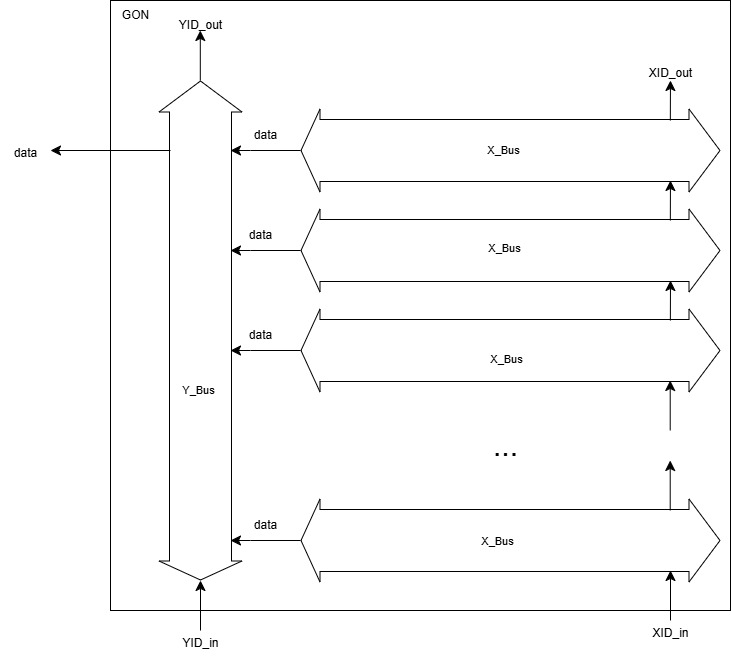  
將多個Bus串起來，資料留會先流經`X Bus`，在流向 `Y Bus`，`X Bus`的ID 也會透過`ID scan in`, `ID scan out`傳遞，因為data 是由許多master輸出的，所以GON Bus 在輸出時會先選擇valid high的data作為輸出，傳遞到`Y Bus`再選擇valid high的 `X Bus` data輸出，就可以選擇valid為high的`PE`的data了。
* LN
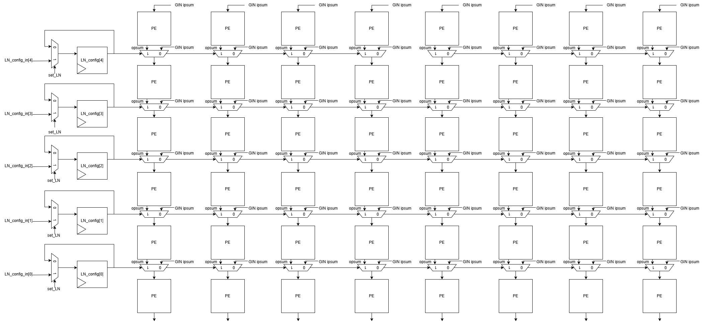
以這次PE array 的6 * 8來看，`LN_config`會有5bit，每一個bit控制兩個row之間的opsum傳遞，因為PE會垂直相加，而如果要切分`PE Set`，有些row之間的資料就必須要輸入GIN ipsum的資料而非上個opsum，故使`LN_config`作為mux的`sel` 訊號，而因為`PE`的`ipsum`輸入需要握手訊號，這部分也需要使用`LN_config`作選擇，像是若下個PE需要輸入上個PE的`ipsum`，上個PE的`opsum ready`就會變成下個PE的`ipsum ready`等。

### Explain how you implement PPU
> Explain how you handle the computation of the zero point of requantization \
> Explain the order of 3 component(PostQuant, MaxPool, ReLU) and the reason why you design like that.  

根據Lab3講義所述，量化後模型在硬體實現矩陣乘法可以表示為  
$$
\bar y_{m,~e,~f} = \text{clanmp} \left[ \left( \left(
    (\bar b_m + \sum_{c,~r,~s} (\bar x_{c,~Ue+r,~Uf+s} \oplus 128) \cdot \bar w_{m,~c,~r,~s}^T) 
        \gg \frac{s_x s_w}{s_y} \right) \oplus 128 \right) ,0 , 255\right]$$  
其中$\left( ... \frac{s_x s_w}{s_y} \right) \oplus 128$ 為加上128在硬體上的實現，故在`post_quant.sv`中，會先128做bitwise xor，如下
```verilog
assign quanted_value = product_scaling_factor ^ 8'd128;
```
* PostQuant  
  
先經過>>將`data_in`右shift作除以`scaling_factor`，再看其MSB是否有大於8'd127，若有，則clamp 到8'd127，再與8'd128 xor，作為加128的硬體實現。
* MaxPool  
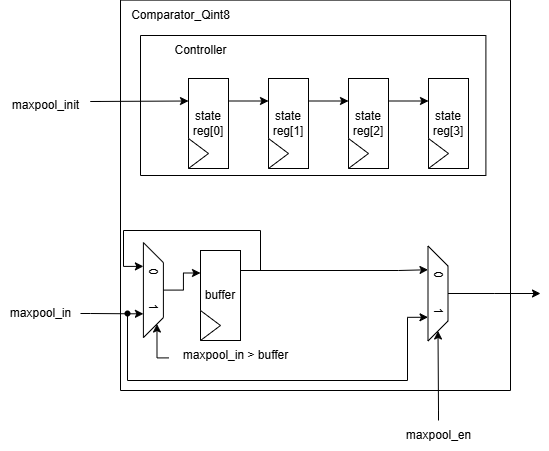  
`maxpool_init`，會傳入controller，4cycle之後，會判斷是否要傳buffer的資料，buffer會比對`maxpool_in`與其自身誰較大更新自己，且4cycle完之後會reset他自己，如`maxpool_en`=0，則作為buffer，傳遞`maxpool_in`。
* ReLU  
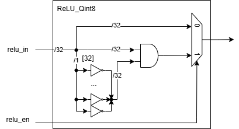  
取其MSB的inverter，做成mask，與`data_in`and，如`relu_en`=0，則作為buffer，傳遞`relu_in`。
* PPU
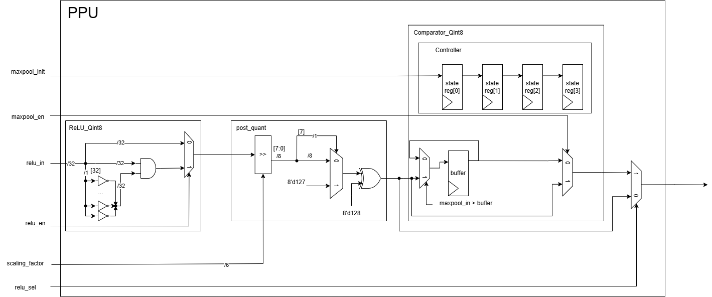
將上述三個模組都串起來，經過ReLU, post_quant, 最後經過maxpool選值，會透過`relu_sel`選擇需要relu值還是maxpool值。
### Result

| Component | Pass (Y/N) |
|:---------:|:----------:|
|    PE     |      Y     |
| PE array  |      Y     |
|    PPU    |      Y     |


## Question (50%)

### Question 1 (20%)

Explain how data reuse is achieved in the design presented in the Eyeriss paper.  
Eyeriss 將每個PE上面接著的MC編號(`id`)，在傳送資料時，透過GIN會把資料與目標PE(`tag`)一起傳送到PE array上，透過比對`tag` 與`id` ，就可以知道是否要將資料傳遞給那些PE，每個PE上的MC都有`id`，這些`id`有可能會重複，尤其是將整個PE array切分為不同的PE set時，ifmap、filter、ipsum都有可能有兩個以上的PE需要同一份資料透過這機制，Eyeriss可以同時將資料傳遞至不同PE，達到Data reuse。  
除外，Eyeriss 計算opsum會使用多個PE的垂直方向相加，所以除了最後一row 的PE opsum直接輸出，與第一row ipsum直接輸入，其餘兩row之間都會使用 Local Network(LN)控制當前PE是否要直接使用上層PE輸出的值，這樣的設計除了可以更容易地切分PE set(ex. 根據mapping方式不同，垂直方向兩PE set有時需要相加有時不用)，也可以直接使用temporal result，不用將psum存入GLB再讀出來。
### Question 2 (10%)

Compute a `16×16` Conv2D operation, given the following configuration
- Kernel size: `3×3`
- Stride: `1`
- Padding: `1`
- Global Buffer (GLB) size: `128 KB`
- Mapping parameters:
    - `p = 4`
    - `q = 4`
    - `r = 1`
    - `t = 2`
    - `e = 8`

Determine the value of the mapping parameter `m`

**Please include the calculation process.**
$$
\begin{align}
&\text{GLB total usage} = \text{GLB usage of ifmap} + \text{GLB usage of filter} + \text{GLB usage of bias} + \text{GLB usage of psum}\\
&\text{Where} \\
&\text{GLB usage of ifmap} = n \times qr \times (U(e-1) + R) \times W \times 1 ~ \text{byte}\\
&\text{GLB usage of filter} = (p\times t)\times (q\times r) \times R \times S ~ \text{byte}\\
&\text{GLB usage of bias} = p \times t \times 4 ~\text{byte}\\
&\text{GLB usage of psum} = n \times m \times e  \times F ~ \times 4 ~ \text{byte}\\
&\text{R} = \text{S} = 3, ~ \text{F} = \text{W} = 16, ~ \text{n} = 1 \\
&\text{F} = \left\lfloor\frac{H - 3 + 2P}{U}\right\rfloor + 1 = \left\lfloor\frac{16 - 3 + 2}{1}\right\rfloor + 1 = 16\\
&\overbrace{
	1 \times 4 \times (1(8-1) + 3) \times 16 \times 1
}^\text{GLB usage of ifmap} +
\overbrace{
	(4\times 2)\times (4\times 1) \times 3 \times 3
}^\text{GLB usage of filter} +
\overbrace{
4 \times 2 \times 4
}^\text{GLB usage of bias} +
\overbrace{
1 \times m \times 8  \times 16 \times 4
}^\text{GLB usage of psum} \leq 128 \times 1024 = 131072 ~ \text{byte} \\
& 960 + 512\text{m}\leq 131072 \\
& \text{m} \leq \frac{131072 - 960}{512} = 254.125 \text{(m must be an integer)}\\
& \text{m} = 254  
\end{align}
$$

### Question3 (10%)
In the testbench, explain how to compute the multicast controller’s ID (`X_ID`, `Y_ID`) and the data tags (`tag_X`, `tag_Y`) based on the mapping parameters and shape parameters.
1. ID
	* filter
		- X_ID  
		根據切分出來的PE set的w決定，同一個set中，`X_ID`會相同，如tb0, tb1, tb2等在col方向上PE array並沒有被分割，故同個PE set的同個row `X_ID`相同(ex. 0,0,0,0,0,0,0,0,1,1,1,1,1,1,1,1 ...)，而tb3有在col方向上切成兩個PE set，故變成4個一組一樣(ex. 0,0,0,0,3,3,3,3 ...)。
		- Y_ID  
		根據切分出來的PE set的h決定，row 方向被切分為兩組，即使兩PE set用到的是一樣的filter，但channel不同，輸入的資料還是不一樣，就會是 0,0,0,1,1,1但若是同一PE set的折疊，如tb5，需要傳入一樣的filter，故為 0,0,0,0,0,0。
	* ifmap
		- X_ID  
		會以對角線方式給，被分出來的PE set的w決定何時換行，如tb0等col方向沒被切舉例

		||||||||||
		|---|---|---|---|---|---|---|---|---|
		||0|1|2|3|4|5|6|7|
		||1|2|3|4|5|6|7|8|
		||2|3|4|5|6|7|8|9|
		||0|1|2|3|4|5|6|7|
		||1|2|3|4|5|6|7|8|
		||2|3|4|5|6|7|8|9|  

		因為row方向有被切成兩組，故到9就開始重新從0開始數，但tb3, tb4為  
		||||||||||
		|---|---|---|---|---|---|---|---|---|
		||0|1|2|3|0|1|2|3|
		||1|2|3|4|1|2|3|4|
		||2|3|4|5|2|3|4|5|
		||0|1|2|3|0|1|2|3|
		||1|2|3|4|1|2|3|4|
		||2|3|4|5|2|3|4|5|  
		
		因為 col方向被切分為兩組，故會有重複的0,1,2,3,0,1,2,3...
		- Y_ID  
		從0開始數，如果遇到被切分為PE set，以PE set為單位，0開始數，如tb0, tb1輸入ifmap因為都一樣，故都是0,0,0,0,0,0
		但如tb3等不同PE set有不同ifmap資料時，就會變成000111
	* ipsum
		- X_ID  
		選擇第一row累加的PE，以PE 為單位開始編號，從0開始數，如tb裡面只有最一開始輸入ipsum的PE們為0,1,2,3,4,5,6,7，其餘為31。
		- Y_ID  
		選擇第一row累加的PE，以PE 為單位開始編號，從0開始數，如tb裡面只有最一開始輸入ipsum的PE們為0與1，tb5因為是`e=16`折疊的故都是0，tb3因為垂直兩PE set中間會相加，不需要ipsum，所以只有0，剩下tb若上下被分為兩個set，會數到1，其餘為7。
	* opsum
		- X_ID  
		與ipsum邏輯相同，只是為選擇最後一row輸出opusm 的PE。
		- Y_ID  
		與ipsum邏輯相同，只是為選擇最後一row輸出opusm 的PE，同樣tb5兩row也都一樣。
2. Tag
	* filter
		- tag_X  
		0 到 `index->count_filter_row + FILT_ROW * (index->count_t_W)`。
		- tag_Y  
		0 到 `(index->count_r + index->count_t_H)`。
	* ifmap
		- tag_X  
		0 到 `index->count_ifmap_row`。
		- tag_Y  
		0 到 `index->count_r`。
	* ipsum
		- tag_X  
        0 到 `index->count_ipsum_row + e * index->count_t_W`。
		- tag_Y  
		0 到 `index->count_t_H`。
	* opsum
		- tag_X  
        0 到 `index->count_ipsum_row + e * index->count_t_W`。
		- tag_Y  
		0 到 `index->count_t_H`。
### Question 4 (10%)

For the test case where e = 4,
why are the configurations `(r, t)` = `(1, 4)` and `(2, 2)` present, but `(4, 1)` is not?
What do you think is the reason behind this?
為方便解釋，以下假設q = 3，各`(r, t)`分布如下
* `(r, t)` = `(1, 4)`  
.png)  
假設其中一個pass處裡channel 0 ~ channel 2，切分為4個PE set，每個PE set filter 不同，但ifmap 的channel 相同。  

* `(r, t)` = `(2, 2)`  
.png)  
假設其中一個pass處裡channel 0 ~ channel 5，切分為4個PE set，每個兩組PE set filter 不同，每組PE set裡面的 ifmap channel也不同，但可以由下面往上累加得出opsum。  

* `(r, t)` = `(4, 1)`  
.png)  
假設其中一個pass處裡channel 0 ~ channel 11，切分為4個PE set，每個PE set filter, ifmap channel 不同，若要得到opsum，就必須有橫向的相加，但Eyeriss的 PE array並沒有實現此功能的硬體。  
  
以上述例子來看，`(r, t)` = `(4, 1)`在現行的Eyeriss 硬體上是無法實現的，故沒有`(r, t)` = `(4, 1)`的組合。

**Mapping Parameter**

| Parameter | Description                                                       |
|:---------:| ----------------------------------------------------------------- |
|     m     | number of ofmap channels stored in the GLB                        |
|     n     | number of ifmaps used in a processing pass                        |
|     e     | width fo the PE set                                               |
|     p     | number of filters processed by a PE set                           |
|     q     | number of channels processed by a PE set                          |
|     r     | number of PE sets that process different channels in the PE array |
|     t     | number of PE sets that process different filters in the PE array  |
## Lab Feedback and Suggestions (10%)
1. verilator問題，變數一多即會segmentation fault，同一份code可能不同時間可以過跟不可以過，或是其他同學帳號可以過自己不能過，無法做有效除錯。
2. testbench 的完善，這次作業在繳交截止日(4/21)前兩天(4/19)還在更新testbench，而我就有看到有同學就得testbench可以過但新的testbench不行，希望可以再改善。
3. 有些模組的描述在詳細一點，像是MC在這次Lab是作為Bus的子模型，是在discord與同學助教討論後才知道的，而Lab3講義上MC與Bus的圖例讓人很難聯想到他們是母與子模型關係。
4. 幾個簡單的測資希望用圖例表示，像是PE的tb0，畫出三維資料圖應該讓人比較好理解。
